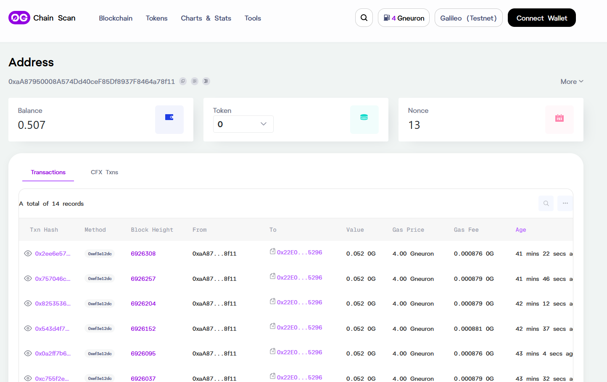

# 本项目使用0g上传和下载文件分片:
## 1.编译
   go build
## 2.配置.env文件
  ##### OG_CHAIN_URL="https://evmrpc-testnet.0g.ai"         # 0g链RPC地址
  ##### OG_INDEXER_URL="https://indexer-storage-testnet-turbo.0g.ai" # 0g索引器地址
  ##### OG_PRIVATE_KEY="0x"  #替换成你的私钥
  ##### INPUT_FILE=./upload_4GB.bin  #文件路径配置（按需改）
  ##### OUTPUT_FILE=./downloaded_4gb.bin  文件路径配置（按需改）
  ##### OP_TIMEOUT=1h  # 整体操作超时时间（支持 1h=1小时、30m=30分钟、2h30m=2小时30分钟）
  ##### CONCURRENT_ROUTINES=4  ## 并发上传/下载协程数（建议 2-8，网络好可以调大）
  ##### DOWNLOAD_WITH_PROOF=true  # 下载时是否验证 Merkle 证明（true=验证数据完整性，false=不验证）
  ##### FRAGMENT_SIZE=419430400 # 分片大小：400MB（10个分片合计4GB）
  ##### TOTAL_FILE_SIZE=4294967296  # 总文件大小：4GB（确保源文件符合）

## 3.运行
    ./og-uploadDown

## 4.效果展示

## 5.日志:
  分片 1 上传成功！交易哈希：0xe31d3bb1b1a7e79db7f8e16615b5ee8e0c6eefbe1f8a2103c930d4b1b4081e5a，根哈希：0x779df4fb5704bce50abcfc17d12f0545b94b70e10cb1d99ec62549172cffdfb
8"
time="2025-11-19T17:33:16+08:00" level=info msg="🚀 开始上传分片 2"
time="2025-11-19T17:33:25+08:00" level=info msg="get storage nodes from indexer (trusted: 2, discovered: 0)"
time="2025-11-19T17:33:27+08:00" level=info msg="Data prepared to upload" chunks=1638400 segments=1600 size=419430400
time="2025-11-19T17:33:28+08:00" level=info msg="Data merkle root calculated" root=0x779df4fb5704bce50abcfc17d12f0545b94b70e10cb1d99ec62549172cffdfb8
time="2025-11-19T17:33:28+08:00" level=info msg="Prepare to submit log entry" root=0x779df4fb5704bce50abcfc17d12f0545b94b70e10cb1d99ec62549172cffdfb8
time="2025-11-19T17:33:29+08:00" level=info msg="submit with fee" fee(neuron)=52368164061970432
time="2025-11-19T17:33:29+08:00" level=info msg="Set nonce" nonce=6
time="2025-11-19T17:33:29+08:00" level=info msg="Set gas price" gasPrice=4000000007
time="2025-11-19T17:33:30+08:00" level=info msg="Transaction receipt" receipt="<nil>" txHash=0x6c24182ac7cc35eb841d96c794243676813e58229193a1fd5dfd8b15a819ef0c
time="2025-11-19T17:33:33+08:00" level=info msg="Transaction receipt" receipt="<nil>" txHash=0x6c24182ac7cc35eb841d96c794243676813e58229193a1fd5dfd8b15a819ef0c
time="2025-11-19T17:33:37+08:00" level=info msg="Transaction receipt" receipt="&{0xb5b9b06e9b687a357c58ed2c3db92923e54d6ea525884d591e0fd942c329c7e6 6925987 <nil> <nil> 219828 4000000007 0xaA87950008A574Dd40ceF85Df8937F8464a78f11 219828 [0xc00016a000] [0 0 0 0 0 0 0 0 0 0 0 0 0 0 0 0 8 0 0 0 0 0 0 0 0 0 0 0 0 0 0 0 0 0 128 0 0 0 0 0 0 0 0 0 0 0 0 0 0 0 0 0 0 0 0 0 0 16 0 0 16 0 0 0 0 0 0 0 0 0 0 0 0 0 1 0 0 0 0 0 0 0 0 0 0 0 0 0 0 0 0 
0 0 0 0 16 0 0 0 0 0 0 16 0 0 0 0 0 0 0 0 0 0 0 0 0 0 0 0 0 0 0 0 0 0 0 4 0 0 0 0 0 0 0 0 0 0 0 0 0 0 0 0 0 128 0 0 0 0 0 0 0 0 0 0 0 0 0 0 0 0 0 0 0 0 0 0 0 0 0 16 0 0 0 0 0 0 0 0 0 0 1 0 0 0 0 0 0 0 0 0 0 0 0 0 0 0 0 
0 0 0 0 0 0 0 0 0 0 0 0 0 0 0 0 0 0 0 0 0 0 0 0 0 0 0 0 0 0 0 0 0 0 0 0 0 0 0 0 0 0 0 0 0 0 0 0 0 32 0 0 0 0 0 0 0 0] [] 0xc000362ae0 0x22E03a6A89B950F1c82ec5e74F8eCa321a105296 0x6c24182ac7cc35eb841d96c794243676813e58229193a1fd5dfd8b15a819ef0c 0 <nil> 0xc000362af0}" txHash=0x6c24182ac7cc35eb841d96c794243676813e58229193a1fd5dfd8b15a819ef0c
time="2025-11-19T17:33:40+08:00" level=info msg="Succeeded to send transaction to append log entry" hash=0x6c24182ac7cc35eb841d96c794243676813e58229193a1fd5dfd8b15a819ef0c
time="2025-11-19T17:33:40+08:00" level=info msg="Wait for log entry on storage node" finality=1 root=0x779df4fb5704bce50abcfc17d12f0545b94b70e10cb1d99ec62549172cffdfb8 txSeq=9016
time="2025-11-19T17:33:41+08:00" level=info msg="Begin to upload file" nodeNum=2 root=0x779df4fb5704bce50abcfc17d12f0545b94b70e10cb1d99ec62549172cffdfb8 segNum=1600 sequence=9016
time="2025-11-19T17:33:42+08:00" level=info msg="Completed to upload file" duration=684.8308ms root=0x779df4fb5704bce50abcfc17d12f0545b94b70e10cb1d99ec62549172cffdfb8 segNum=1600 sequence=9016
time="2025-11-19T17:33:42+08:00" level=info msg="Wait for log entry on storage node" finality=1 root=0x779df4fb5704bce50abcfc17d12f0545b94b70e10cb1d99ec62549172cffdfb8 txSeq=9016
time="2025-11-19T17:33:43+08:00" level=info msg="upload took" duration=16.593541s
time="2025-11-19T17:33:43+08:00" level=info msg="✅ 分片 2 上传成功！交易哈希：0x6c24182ac7cc35eb841d96c794243676813e58229193a1fd5dfd8b15a819ef0c，根哈希：0x779df4fb5704bce50abcfc17d12f0545b94b70e10cb1d99ec62549172cffdfb
8"
time="2025-11-19T17:33:43+08:00" level=info msg="🚀 开始上传分片 3"
time="2025-11-19T17:33:49+08:00" level=info msg="get storage nodes from indexer (trusted: 2, discovered: 0)"
time="2025-11-19T17:33:50+08:00" level=info msg="Data prepared to upload" chunks=1638400 segments=1600 size=419430400
time="2025-11-19T17:33:51+08:00" level=info msg="Data merkle root calculated" root=0x779df4fb5704bce50abcfc17d12f0545b94b70e10cb1d99ec62549172cffdfb8
time="2025-11-19T17:33:52+08:00" level=info msg="Prepare to submit log entry" root=0x779df4fb5704bce50abcfc17d12f0545b94b70e10cb1d99ec62549172cffdfb8
time="2025-11-19T17:33:53+08:00" level=info msg="submit with fee" fee(neuron)=52368164061970432
time="2025-11-19T17:33:53+08:00" level=info msg="Set nonce" nonce=7
time="2025-11-19T17:33:53+08:00" level=info msg="Set gas price" gasPrice=4000000007
time="2025-11-19T17:33:54+08:00" level=info msg="Transaction receipt" receipt="<nil>" txHash=0xc755f2e11cf76525cd8dd629e70f093551e052adb8ae3e59f1f590ed6966bff5
time="2025-11-19T17:33:57+08:00" level=info msg="Transaction receipt" receipt="<nil>" txHash=0xc755f2e11cf76525cd8dd629e70f093551e052adb8ae3e59f1f590ed6966bff5
time="2025-11-19T17:34:00+08:00" level=info msg="Transaction receipt" receipt="&{0x4d3984a44e437215ceaab9399f38e34c50f52f0c9449b7dda46ce1828a85937f 6926037 <nil> <nil> 219805 4000000007 0xaA87950008A574Dd40ceF85Df8937F8464a78f11 219805 [0xc00016a000] [0 0 0 0 0 0 0 0 0 0 0 0 0 0 0 0 8 0 0 0 0 0 0 0 0 0 0 0 0 0 0 0 0 0 128 0 0 0 0 0 0 0 0 0 0 0 0 0 0 0 0 0 0 0 0 0 0 16 0 0 16 0 0 0 0 0 0 0 0 0 0 0 0 0 1 0 0 0 0 0 0 0 0 0 0 0 0 0 0 0 0 
0 0 0 0 16 0 0 0 0 0 0 16 0 0 0 0 0 0 0 0 0 0 0 0 0 0 0 0 0 0 0 0 0 0 0 4 0 0 0 0 0 0 0 0 0 0 0 0 0 0 0 0 0 128 0 0 0 0 0 0 0 0 0 0 0 0 0 0 0 0 0 0 0 0 0 0 0 0 0 16 0 0 0 0 0 0 0 0 0 0 1 0 0 0 0 0 0 0 0 0 0 0 0 0 0 0 0 
0 0 0 0 0 0 0 0 0 0 0 0 0 0 0 0 0 0 0 0 0 0 0 0 0 0 0 0 0 0 0 0 0 0 0 0 0 0 0 0 0 0 0 0 0 0 0 0 0 32 0 0 0 0 0 0 0 0] [] 0xc000362490 0x22E03a6A89B950F1c82ec5e74F8eCa321a105296 0xc755f2e11cf76525cd8dd629e70f093551e052adb8ae3e59f1f590ed6966bff5 0 <nil> 0xc0003624a0}" txHash=0xc755f2e11cf76525cd8dd629e70f093551e052adb8ae3e59f1f590ed6966bff5
time="2025-11-19T17:34:03+08:00" level=info msg="Succeeded to send transaction to append log entry" hash=0xc755f2e11cf76525cd8dd629e70f093551e052adb8ae3e59f1f590ed6966bff5
time="2025-11-19T17:34:03+08:00" level=info msg="Wait for log entry on storage node" finality=1 root=0x779df4fb5704bce50abcfc17d12f0545b94b70e10cb1d99ec62549172cffdfb8 txSeq=9017
time="2025-11-19T17:34:05+08:00" level=info msg="Begin to upload file" nodeNum=2 root=0x779df4fb5704bce50abcfc17d12f0545b94b70e10cb1d99ec62549172cffdfb8 segNum=1600 sequence=9017
time="2025-11-19T17:34:07+08:00" level=info msg="Completed to upload file" duration=1.4574457s root=0x779df4fb5704bce50abcfc17d12f0545b94b70e10cb1d99ec62549172cffdfb8 segNum=1600 sequence=9017
time="2025-11-19T17:34:07+08:00" level=info msg="Wait for log entry on storage node" finality=1 root=0x779df4fb5704bce50abcfc17d12f0545b94b70e10cb1d99ec62549172cffdfb8 txSeq=9017
time="2025-11-19T17:34:08+08:00" level=info msg="upload took" duration=17.684717s
time="2025-11-19T17:34:08+08:00" level=info msg="✅ 分片 3 上传成功！交易哈希：0xc755f2e11cf76525cd8dd629e70f093551e052adb8ae3e59f1f590ed6966bff5，根哈希：0x779df4fb5704bce50abcfc17d12f0545b94b70e10cb1d99ec62549172cffdfb
8"
time="2025-11-19T17:34:08+08:00" level=info msg="🚀 开始上传分片 4"
time="2025-11-19T17:34:17+08:00" level=info msg="get storage nodes from indexer (trusted: 2, discovered: 0)"
time="2025-11-19T17:34:19+08:00" level=info msg="Data prepared to upload" chunks=1638400 segments=1600 size=419430400
time="2025-11-19T17:34:19+08:00" level=info msg="Data merkle root calculated" root=0x779df4fb5704bce50abcfc17d12f0545b94b70e10cb1d99ec62549172cffdfb8
time="2025-11-19T17:34:20+08:00" level=info msg="Prepare to submit log entry" root=0x779df4fb5704bce50abcfc17d12f0545b94b70e10cb1d99ec62549172cffdfb8
time="2025-11-19T17:34:21+08:00" level=info msg="submit with fee" fee(neuron)=52368164061970432
time="2025-11-19T17:34:21+08:00" level=info msg="Set nonce" nonce=8
time="2025-11-19T17:34:21+08:00" level=info msg="Set gas price" gasPrice=4000000007
time="2025-11-19T17:34:22+08:00" level=info msg="Transaction receipt" receipt="<nil>" txHash=0x0a2ff7b6bbda5a44f02a9c194fc8118a9bb553db7bf81aa401450b45462c39bf
time="2025-11-19T17:34:25+08:00" level=info msg="Transaction receipt" receipt="<nil>" txHash=0x0a2ff7b6bbda5a44f02a9c194fc8118a9bb553db7bf81aa401450b45462c39bf
time="2025-11-19T17:34:29+08:00" level=info msg="Transaction receipt" receipt="&{0x20246f4b9637ecc9e50ad1f3931787ba14a3efb811020bebaad738bcfbb26e47 6926095 <nil> <nil> 219138 4000000007 0xaA87950008A574Dd40ceF85Df8937F8464a78f11 219138 [0xc00016a000] [0 0 0 0 0 0 0 0 0 0 0 0 0 0 0 0 8 0 0 0 0 0 0 0 0 0 0 0 0 0 0 0 0 0 128 0 0 0 0 0 0 0 0 0 0 0 0 0 0 0 0 0 0 0 0 0 0 16 0 0 16 0 0 0 0 0 0 0 0 0 0 0 0 0 1 0 0 0 0 0 0 0 0 0 0 0 0 0 0 0 0 
0 0 0 0 16 0 0 0 0 0 0 16 0 0 0 0 0 0 0 0 0 0 0 0 0 0 0 0 0 0 0 0 0 0 0 4 0 0 0 0 0 0 0 0 0 0 0 0 0 0 0 0 0 128 0 0 0 0 0 0 0 0 0 0 0 0 0 0 0 0 0 0 0 0 0 0 0 0 0 16 0 0 0 0 0 0 0 0 0 0 1 0 0 0 0 0 0 0 0 0 0 0 0 0 0 0 0 
0 0 0 0 0 0 0 0 0 0 0 0 0 0 0 0 0 0 0 0 0 0 0 0 0 0 0 0 0 0 0 0 0 0 0 0 0 0 0 0 0 0 0 0 0 0 0 0 0 32 0 0 0 0 0 0 0 0] [] 0xc00048ce78 0x22E03a6A89B950F1c82ec5e74F8eCa321a105296 0x0a2ff7b6bbda5a44f02a9c194fc8118a9bb553db7bf81aa401450b45462c39bf 0 <nil> 0xc00048ce88}" txHash=0x0a2ff7b6bbda5a44f02a9c194fc8118a9bb553db7bf81aa401450b45462c39bf
time="2025-11-19T17:34:32+08:00" level=info msg="Succeeded to send transaction to append log entry" hash=0x0a2ff7b6bbda5a44f02a9c194fc8118a9bb553db7bf81aa401450b45462c39bf
time="2025-11-19T17:34:32+08:00" level=info msg="Wait for log entry on storage node" finality=1 root=0x779df4fb5704bce50abcfc17d12f0545b94b70e10cb1d99ec62549172cffdfb8 txSeq=9018
time="2025-11-19T17:34:33+08:00" level=info msg="Begin to upload file" nodeNum=2 root=0x779df4fb5704bce50abcfc17d12f0545b94b70e10cb1d99ec62549172cffdfb8 segNum=1600 sequence=9018
time="2025-11-19T17:34:34+08:00" level=info msg="Completed to upload file" duration=847.768ms root=0x779df4fb5704bce50abcfc17d12f0545b94b70e10cb1d99ec62549172cffdfb8 segNum=1600 sequence=9018
time="2025-11-19T17:34:34+08:00" level=info msg="Wait for log entry on storage node" finality=1 root=0x779df4fb5704bce50abcfc17d12f0545b94b70e10cb1d99ec62549172cffdfb8 txSeq=9018
time="2025-11-19T17:34:36+08:00" level=info msg="upload took" duration=17.6614086s
time="2025-11-19T17:34:36+08:00" level=info msg="✅ 分片 4 上传成功！交易哈希：0x0a2ff7b6bbda5a44f02a9c194fc8118a9bb553db7bf81aa401450b45462c39bf，根哈希：0x779df4fb5704bce50abcfc17d12f0545b94b70e10cb1d99ec62549172cffdfb
8"
time="2025-11-19T17:34:36+08:00" level=info msg="🚀 开始上传分片 5"
time="2025-11-19T17:34:43+08:00" level=info msg="get storage nodes from indexer (trusted: 2, discovered: 0)"
time="2025-11-19T17:34:46+08:00" level=info msg="Data prepared to upload" chunks=1638400 segments=1600 size=419430400
time="2025-11-19T17:34:47+08:00" level=info msg="Data merkle root calculated" root=0x779df4fb5704bce50abcfc17d12f0545b94b70e10cb1d99ec62549172cffdfb8
time="2025-11-19T17:34:47+08:00" level=info msg="Prepare to submit log entry" root=0x779df4fb5704bce50abcfc17d12f0545b94b70e10cb1d99ec62549172cffdfb8
time="2025-11-19T17:34:48+08:00" level=info msg="submit with fee" fee(neuron)=52368164061970432
time="2025-11-19T17:34:48+08:00" level=info msg="Set nonce" nonce=9
time="2025-11-19T17:34:48+08:00" level=info msg="Set gas price" gasPrice=4000000007
time="2025-11-19T17:34:49+08:00" level=info msg="Transaction receipt" receipt="<nil>" txHash=0x543d4f71abae0b7a45d5ceb21a4f10ca23ac0c26e1d8fef9775fee5ff94a6018
time="2025-11-19T17:34:53+08:00" level=info msg="Transaction receipt" receipt="<nil>" txHash=0x543d4f71abae0b7a45d5ceb21a4f10ca23ac0c26e1d8fef9775fee5ff94a6018
time="2025-11-19T17:34:56+08:00" level=info msg="Transaction receipt" receipt="&{0x19245314a31820849a0080f779bb0dbdaeaac896ba50f42e1264b6a090b1c541 6926152 <nil> <nil> 220472 4000000007 0xaA87950008A574Dd40ceF85Df8937F8464a78f11 220472 [0xc00016a000] [0 0 0 0 0 0 0 0 0 0 0 0 0 0 0 0 8 0 0 0 0 0 0 0 0 0 0 0 0 0 0 0 0 0 128 0 0 0 0 0 0 0 0 0 0 0 0 0 0 0 0 0 0 0 0 0 0 16 0 0 16 0 0 0 0 0 0 0 0 0 0 0 0 0 1 0 0 0 0 0 0 0 0 0 0 0 0 0 0 0 0 
0 0 0 0 16 0 0 0 0 0 0 16 0 0 0 0 0 0 0 0 0 0 0 0 0 0 0 0 0 0 0 0 0 0 0 4 0 0 0 0 0 0 0 0 0 0 0 0 0 0 0 0 0 128 0 0 0 0 0 0 0 0 0 0 0 0 0 0 0 0 0 0 0 0 0 0 0 0 0 16 0 0 0 0 0 0 0 0 0 0 1 0 0 0 0 0 0 0 0 0 0 0 0 0 0 0 0 
0 0 0 0 0 0 0 0 0 0 0 0 0 0 0 0 0 0 0 0 0 0 0 0 0 0 0 0 0 0 0 0 0 0 0 0 0 0 0 0 0 0 0 0 0 0 0 0 0 32 0 0 0 0 0 0 0 0] [] 0xc00048c960 0x22E03a6A89B950F1c82ec5e74F8eCa321a105296 0x543d4f71abae0b7a45d5ceb21a4f10ca23ac0c26e1d8fef9775fee5ff94a6018 0 <nil> 0xc00048c970}" txHash=0x543d4f71abae0b7a45d5ceb21a4f10ca23ac0c26e1d8fef9775fee5ff94a6018
time="2025-11-19T17:34:59+08:00" level=info msg="Succeeded to send transaction to append log entry" hash=0x543d4f71abae0b7a45d5ceb21a4f10ca23ac0c26e1d8fef9775fee5ff94a6018
time="2025-11-19T17:34:59+08:00" level=info msg="Wait for log entry on storage node" finality=1 root=0x779df4fb5704bce50abcfc17d12f0545b94b70e10cb1d99ec62549172cffdfb8 txSeq=9019
time="2025-11-19T17:35:01+08:00" level=info msg="Begin to upload file" nodeNum=2 root=0x779df4fb5704bce50abcfc17d12f0545b94b70e10cb1d99ec62549172cffdfb8 segNum=1600 sequence=9019
time="2025-11-19T17:35:01+08:00" level=info msg="Completed to upload file" duration=700.9139ms root=0x779df4fb5704bce50abcfc17d12f0545b94b70e10cb1d99ec62549172cffdfb8 segNum=1600 sequence=9019
time="2025-11-19T17:35:01+08:00" level=info msg="Wait for log entry on storage node" finality=1 root=0x779df4fb5704bce50abcfc17d12f0545b94b70e10cb1d99ec62549172cffdfb8 txSeq=9019
time="2025-11-19T17:35:03+08:00" level=info msg="upload took" duration=16.8187492s
time="2025-11-19T17:35:03+08:00" level=info msg="✅ 分片 5 上传成功！交易哈希：0x543d4f71abae0b7a45d5ceb21a4f10ca23ac0c26e1d8fef9775fee5ff94a6018，根哈希：0x779df4fb5704bce50abcfc17d12f0545b94b70e10cb1d99ec62549172cffdfb
8"
time="2025-11-19T17:35:03+08:00" level=info msg="🚀 开始上传分片 6"
time="2025-11-19T17:35:10+08:00" level=info msg="get storage nodes from indexer (trusted: 2, discovered: 0)"
time="2025-11-19T17:35:11+08:00" level=info msg="Data prepared to upload" chunks=1638400 segments=1600 size=419430400
time="2025-11-19T17:35:12+08:00" level=info msg="Data merkle root calculated" root=0x779df4fb5704bce50abcfc17d12f0545b94b70e10cb1d99ec62549172cffdfb8
time="2025-11-19T17:35:12+08:00" level=info msg="Prepare to submit log entry" root=0x779df4fb5704bce50abcfc17d12f0545b94b70e10cb1d99ec62549172cffdfb8
time="2025-11-19T17:35:13+08:00" level=info msg="submit with fee" fee(neuron)=52368164061970432
time="2025-11-19T17:35:13+08:00" level=info msg="Set nonce" nonce=10
time="2025-11-19T17:35:14+08:00" level=info msg="Set gas price" gasPrice=4000000007
time="2025-11-19T17:35:15+08:00" level=info msg="Transaction receipt" receipt="<nil>" txHash=0x82535361f16b959b5a25cd7c547302e5c0b74e58ad9cc6007b95cdbd85539067
time="2025-11-19T17:35:18+08:00" level=info msg="Transaction receipt" receipt="<nil>" txHash=0x82535361f16b959b5a25cd7c547302e5c0b74e58ad9cc6007b95cdbd85539067
time="2025-11-19T17:35:22+08:00" level=info msg="Transaction receipt" receipt="&{0x69dfb55f8baf0ccc558fd8d489ffa34c0e18d31f49464cd0fd906bf6e140818f 6926204 <nil> <nil> 219805 4000000007 0xaA87950008A574Dd40ceF85Df8937F8464a78f11 219805 [0xc00016a000] [0 0 0 0 0 0 0 0 0 0 0 0 0 0 0 0 8 0 0 0 0 0 0 0 0 0 0 0 0 0 0 0 0 0 128 0 0 0 0 0 0 0 0 0 0 0 0 0 0 0 0 0 0 0 0 0 0 16 0 0 16 0 0 0 0 0 0 0 0 0 0 0 0 0 1 0 0 0 0 0 0 0 0 0 0 0 0 0 0 0 0 
0 0 0 0 16 0 0 0 0 0 0 16 0 0 0 0 0 0 0 0 0 0 0 0 0 0 0 0 0 0 0 0 0 0 0 4 0 0 0 0 0 0 0 0 0 0 0 0 0 0 0 0 0 128 0 0 0 0 0 0 0 0 0 0 0 0 0 0 0 0 0 0 0 0 0 0 0 0 0 16 0 0 0 0 0 0 0 0 0 0 1 0 0 0 0 0 0 0 0 0 0 0 0 0 0 0 0 
0 0 0 0 0 0 0 0 0 0 0 0 0 0 0 0 0 0 0 0 0 0 0 0 0 0 0 0 0 0 0 0 0 0 0 0 0 0 0 0 0 0 0 0 0 0 0 0 0 32 0 0 0 0 0 0 0 0] [] 0xc000422880 0x22E03a6A89B950F1c82ec5e74F8eCa321a105296 0x82535361f16b959b5a25cd7c547302e5c0b74e58ad9cc6007b95cdbd85539067 0 <nil> 0xc000422890}" txHash=0x82535361f16b959b5a25cd7c547302e5c0b74e58ad9cc6007b95cdbd85539067
time="2025-11-19T17:35:25+08:00" level=info msg="Succeeded to send transaction to append log entry" hash=0x82535361f16b959b5a25cd7c547302e5c0b74e58ad9cc6007b95cdbd85539067
time="2025-11-19T17:35:25+08:00" level=info msg="Wait for log entry on storage node" finality=1 root=0x779df4fb5704bce50abcfc17d12f0545b94b70e10cb1d99ec62549172cffdfb8 txSeq=9020
time="2025-11-19T17:35:27+08:00" level=info msg="Begin to upload file" nodeNum=2 root=0x779df4fb5704bce50abcfc17d12f0545b94b70e10cb1d99ec62549172cffdfb8 segNum=1600 sequence=9020
time="2025-11-19T17:35:27+08:00" level=info msg="Completed to upload file" duration=844.9763ms root=0x779df4fb5704bce50abcfc17d12f0545b94b70e10cb1d99ec62549172cffdfb8 segNum=1600 sequence=9020
time="2025-11-19T17:35:27+08:00" level=info msg="Wait for log entry on storage node" finality=1 root=0x779df4fb5704bce50abcfc17d12f0545b94b70e10cb1d99ec62549172cffdfb8 txSeq=9020
time="2025-11-19T17:35:29+08:00" level=info msg="upload took" duration=18.3632304s
time="2025-11-19T17:35:29+08:00" level=info msg="✅ 分片 6 上传成功！交易哈希：0x82535361f16b959b5a25cd7c547302e5c0b74e58ad9cc6007b95cdbd85539067，根哈希：0x779df4fb5704bce50abcfc17d12f0545b94b70e10cb1d99ec62549172cffdfb
8"
time="2025-11-19T17:35:29+08:00" level=info msg="🚀 开始上传分片 7"
time="2025-11-19T17:35:35+08:00" level=info msg="get storage nodes from indexer (trusted: 2, discovered: 0)"
time="2025-11-19T17:35:37+08:00" level=info msg="Data prepared to upload" chunks=1638400 segments=1600 size=419430400
time="2025-11-19T17:35:37+08:00" level=info msg="Data merkle root calculated" root=0x779df4fb5704bce50abcfc17d12f0545b94b70e10cb1d99ec62549172cffdfb8
time="2025-11-19T17:35:38+08:00" level=info msg="Prepare to submit log entry" root=0x779df4fb5704bce50abcfc17d12f0545b94b70e10cb1d99ec62549172cffdfb8
time="2025-11-19T17:35:39+08:00" level=info msg="submit with fee" fee(neuron)=52368164061970432
time="2025-11-19T17:35:39+08:00" level=info msg="Set nonce" nonce=11
time="2025-11-19T17:35:39+08:00" level=info msg="Set gas price" gasPrice=4000000007
time="2025-11-19T17:35:40+08:00" level=info msg="Transaction receipt" receipt="<nil>" txHash=0x757046cbe45b1c6c3448da5a1444b6837e3bc67594e6a267d8568909e5402eec
time="2025-11-19T17:35:43+08:00" level=info msg="Transaction receipt" receipt="<nil>" txHash=0x757046cbe45b1c6c3448da5a1444b6837e3bc67594e6a267d8568909e5402eec
time="2025-11-19T17:35:46+08:00" level=info msg="Transaction receipt" receipt="&{0x3066cf103b393d9e301c6c170beaa2100f3ac9a388731d2accdaa01e27bf6962 6926257 <nil> <nil> 219782 4000000007 0xaA87950008A574Dd40ceF85Df8937F8464a78f11 219782 [0xc00016a000] [0 0 0 0 0 0 0 0 0 0 0 0 0 0 0 0 8 0 0 0 0 0 0 0 0 0 0 0 0 0 0 0 0 0 128 0 0 0 0 0 0 0 0 0 0 0 0 0 0 0 0 0 0 0 0 0 0 16 0 0 16 0 0 0 0 0 0 0 0 0 0 0 0 0 1 0 0 0 0 0 0 0 0 0 0 0 0 0 0 0 0 
0 0 0 0 16 0 0 0 0 0 0 16 0 0 0 0 0 0 0 0 0 0 0 0 0 0 0 0 0 0 0 0 0 0 0 4 0 0 0 0 0 0 0 0 0 0 0 0 0 0 0 0 0 128 0 0 0 0 0 0 0 0 0 0 0 0 0 0 0 0 0 0 0 0 0 0 0 0 0 16 0 0 0 0 0 0 0 0 0 0 1 0 0 0 0 0 0 0 0 0 0 0 0 0 0 0 0 
0 0 0 0 0 0 0 0 0 0 0 0 0 0 0 0 0 0 0 0 0 0 0 0 0 0 0 0 0 0 0 0 0 0 0 0 0 0 0 0 0 0 0 0 0 0 0 0 0 32 0 0 0 0 0 0 0 0] [] 0xc00068e890 0x22E03a6A89B950F1c82ec5e74F8eCa321a105296 0x757046cbe45b1c6c3448da5a1444b6837e3bc67594e6a267d8568909e5402eec 0 <nil> 0xc00068e8a0}" txHash=0x757046cbe45b1c6c3448da5a1444b6837e3bc67594e6a267d8568909e5402eec
time="2025-11-19T17:35:49+08:00" level=info msg="Succeeded to send transaction to append log entry" hash=0x757046cbe45b1c6c3448da5a1444b6837e3bc67594e6a267d8568909e5402eec
time="2025-11-19T17:35:49+08:00" level=info msg="Wait for log entry on storage node" finality=1 root=0x779df4fb5704bce50abcfc17d12f0545b94b70e10cb1d99ec62549172cffdfb8 txSeq=9021
time="2025-11-19T17:35:51+08:00" level=info msg="Begin to upload file" nodeNum=2 root=0x779df4fb5704bce50abcfc17d12f0545b94b70e10cb1d99ec62549172cffdfb8 segNum=1600 sequence=9021
time="2025-11-19T17:35:52+08:00" level=info msg="Completed to upload file" duration=691.1068ms root=0x779df4fb5704bce50abcfc17d12f0545b94b70e10cb1d99ec62549172cffdfb8 segNum=1600 sequence=9021
time="2025-11-19T17:35:52+08:00" level=info msg="Wait for log entry on storage node" finality=1 root=0x779df4fb5704bce50abcfc17d12f0545b94b70e10cb1d99ec62549172cffdfb8 txSeq=9021
time="2025-11-19T17:35:53+08:00" level=info msg="upload took" duration=16.7376031s
time="2025-11-19T17:35:53+08:00" level=info msg="✅ 分片 7 上传成功！交易哈希：0x757046cbe45b1c6c3448da5a1444b6837e3bc67594e6a267d8568909e5402eec，根哈希：0x779df4fb5704bce50abcfc17d12f0545b94b70e10cb1d99ec62549172cffdfb
8"
time="2025-11-19T17:35:53+08:00" level=info msg="🚀 开始上传分片 8"
time="2025-11-19T17:36:00+08:00" level=info msg="get storage nodes from indexer (trusted: 2, discovered: 0)"
time="2025-11-19T17:36:01+08:00" level=info msg="Data prepared to upload" chunks=1638400 segments=1600 size=419430400
time="2025-11-19T17:36:02+08:00" level=info msg="Data merkle root calculated" root=0x779df4fb5704bce50abcfc17d12f0545b94b70e10cb1d99ec62549172cffdfb8
time="2025-11-19T17:36:02+08:00" level=info msg="Prepare to submit log entry" root=0x779df4fb5704bce50abcfc17d12f0545b94b70e10cb1d99ec62549172cffdfb8
time="2025-11-19T17:36:03+08:00" level=info msg="submit with fee" fee(neuron)=52368164061970432
time="2025-11-19T17:36:04+08:00" level=info msg="Set nonce" nonce=12
time="2025-11-19T17:36:04+08:00" level=info msg="Set gas price" gasPrice=4000000007
time="2025-11-19T17:36:05+08:00" level=info msg="Transaction receipt" receipt="<nil>" txHash=0x2ee6e57f786d86ebe4a8965695e82eef077412cf971d602916ef2c5fb95993e4
time="2025-11-19T17:36:08+08:00" level=info msg="Transaction receipt" receipt="<nil>" txHash=0x2ee6e57f786d86ebe4a8965695e82eef077412cf971d602916ef2c5fb95993e4
time="2025-11-19T17:36:11+08:00" level=info msg="Transaction receipt" receipt="&{0x2bb81b057762bb574ef6ed6568b2f23cc467cd34184b0815805f2c0d48b61436 6926308 <nil> <nil> 219115 4000000007 0xaA87950008A574Dd40ceF85Df8937F8464a78f11 219115 [0xc00016a000] [0 0 0 0 0 0 0 0 0 0 0 0 0 0 0 0 8 0 0 0 0 0 0 0 0 0 0 0 0 0 0 0 0 0 128 0 0 0 0 0 0 0 0 0 0 0 0 0 0 0 0 0 0 0 0 0 0 16 0 0 16 0 0 0 0 0 0 0 0 0 0 0 0 0 1 0 0 0 0 0 0 0 0 0 0 0 0 0 0 0 0 
0 0 0 0 16 0 0 0 0 0 0 16 0 0 0 0 0 0 0 0 0 0 0 0 0 0 0 0 0 0 0 0 0 0 0 4 0 0 0 0 0 0 0 0 0 0 0 0 0 0 0 0 0 128 0 0 0 0 0 0 0 0 0 0 0 0 0 0 0 0 0 0 0 0 0 0 0 0 0 16 0 0 0 0 0 0 0 0 0 0 1 0 0 0 0 0 0 0 0 0 0 0 0 0 0 0 0 
0 0 0 0 0 0 0 0 0 0 0 0 0 0 0 0 0 0 0 0 0 0 0 0 0 0 0 0 0 0 0 0 0 0 0 0 0 0 0 0 0 0 0 0 0 0 0 0 0 32 0 0 0 0 0 0 0 0] [] 0xc000422120 0x22E03a6A89B950F1c82ec5e74F8eCa321a105296 0x2ee6e57f786d86ebe4a8965695e82eef077412cf971d602916ef2c5fb95993e4 0 <nil> 0xc000422130}" txHash=0x2ee6e57f786d86ebe4a8965695e82eef077412cf971d602916ef2c5fb95993e4
time="2025-11-19T17:36:14+08:00" level=info msg="Succeeded to send transaction to append log entry" hash=0x2ee6e57f786d86ebe4a8965695e82eef077412cf971d602916ef2c5fb95993e4
time="2025-11-19T17:36:14+08:00" level=info msg="Wait for log entry on storage node" finality=1 root=0x779df4fb5704bce50abcfc17d12f0545b94b70e10cb1d99ec62549172cffdfb8 txSeq=9022
time="2025-11-19T17:36:16+08:00" level=info msg="Begin to upload file" nodeNum=2 root=0x779df4fb5704bce50abcfc17d12f0545b94b70e10cb1d99ec62549172cffdfb8 segNum=1600 sequence=9022
time="2025-11-19T17:36:17+08:00" level=info msg="Completed to upload file" duration=676.4469ms root=0x779df4fb5704bce50abcfc17d12f0545b94b70e10cb1d99ec62549172cffdfb8 segNum=1600 sequence=9022
time="2025-11-19T17:36:17+08:00" level=info msg="Wait for log entry on storage node" finality=1 root=0x779df4fb5704bce50abcfc17d12f0545b94b70e10cb1d99ec62549172cffdfb8 txSeq=9022
time="2025-11-19T17:36:18+08:00" level=info msg="upload took" duration=16.7106884s
time="2025-11-19T17:36:18+08:00" level=info msg="✅ 分片 8 上传成功！交易哈希：0x2ee6e57f786d86ebe4a8965695e82eef077412cf971d602916ef2c5fb95993e4，根哈希：0x779df4fb5704bce50abcfc17d12f0545b94b70e10cb1d99ec62549172cffdfb

